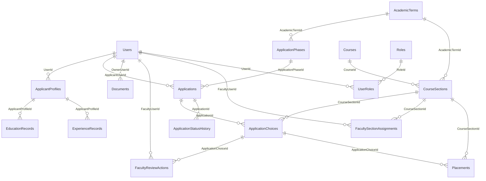

# GTA Application Technical Reference

Pages, APIs, SQL schema, relationships, and end-to-end workflows

Implementation snapshot: August 15, 2026

## Overview

- 27 routed page states
- 49 HTTP endpoints
- 22 application/support tables
- 20 enforced foreign keys

Architecture: React/Vite -> ASP.NET Core minimal APIs -> application services -> EF Core -> SQL Server. Document binaries live outside SQL; SQL stores document metadata and storage keys. Email uses a durable outbox.

## 1. Page inventory

| Route | Role / access | Purpose |
| --- | --- | --- |
| `/` | Public | Redirects visitors to the development sign-in page. |
| `/login` | Anonymous (development) | Lists seeded local identities and creates a development session. |
| `/applicant` | Applicant | Dashboard showing identity, profile completion, document readiness, available sections, and recent applications. |
| `/applicant/profile` | Applicant | Edits personal and academic profile data plus repeatable education and experience records; shows completion. |
| `/applicant/documents` | Applicant | Uploads, versions, and opens the applicant resume and unofficial transcript. |
| `/applicant/sections` | Applicant | Shows active, eligible course sections and whether the applicant already applied. |
| `/applicant/applications/new` | Applicant | Selects employment basis and ranked section choices, validates readiness, and submits an application. |
| `/applicant/applications` | Applicant | Lists the signed-in applicant's submissions, current states, terms, and selected sections. |
| `/applicant/applications/:id` | Owning applicant | Shows one application, choices, status history, and controlled withdrawal when policy allows. |
| `/faculty` | Faculty | Summarizes assigned sections, authorized application workload, interview work, and hire recommendations. |
| `/faculty/sections` | Faculty | Lists only sections assigned to the signed-in faculty member and their application counts. |
| `/faculty/applications` | Faculty | Lists applicants reachable through active faculty-to-section assignments. |
| `/faculty/applications/:choiceId` | Authorized faculty | Shows applicant profile and documents for one selected section; records interview and hire actions. |
| `/faculty/interviews` | Faculty | Filters interview candidates and shows decision and placement workload for assigned sections. |
| `/admin` | Administrator | Operational dashboard with application, applicant, section, review, and warning metrics. |
| `/admin/applications` | Administrator | Searchable cross-system application list with applicant, phase, state, and choices. |
| `/admin/applicants` | Administrator | Searchable applicant directory with profile completion and identity status. |
| `/admin/sections` | Administrator | Edits section capacity/activity and assigns or removes faculty reviewers. |
| `/admin/sections/import` | Administrator | Downloads the CSV template, validates imports, commits accepted rows, and displays import history. |
| `/admin/placements` | Administrator | Activates or removes placements for hire-recommended choices while enforcing capacity and workload rules. |
| `/admin/phases` | Administrator | Edits phase names, program scope, open/close windows, and activation state. |
| `/admin/users` | Administrator | Activates/deactivates users and manages application roles. |
| `/admin/settings` | Administrator | Presents validated controls for non-secret system settings, including section-choice and upload limits. |
| `/admin/audit` | Administrator | Displays administrative and workflow audit events with correlation identifiers. |
| `/admin/email-deliveries` | Administrator | Displays queued, sent, and failed email outbox deliveries and attempt counts. |
| `/access-denied` | Any | Explains that the current identity lacks permission. |
| `*` | Any | Displays the safe page-not-found state; protected route failures use a dedicated retry/error page. |

## 2. API inventory

| Method | Route | Authorization | Responsibility |
| --- | --- | --- | --- |
| GET | `/health/live` | Public | Process liveness check without dependency checks. |
| GET | `/health/ready` | Public | Readiness check including registered infrastructure dependencies. |
| GET | `/openapi/v1.json` | Development | Generated OpenAPI description (development only). |
| GET | `/api/v1/system/info` | Public | Returns service name, environment, and current UTC time. |
| GET | `/api/v1/development/users` | Anonymous / development | Lists seeded identities available to the local login selector. |
| POST | `/api/v1/development/session/{userId}` | Anonymous / development | Creates the strict, HTTP-only development authentication cookie. |
| DELETE | `/api/v1/development/session` | Authenticated / development | Signs out and removes the development session. |
| GET | `/api/v1/auth/me` | Authenticated | Returns current user id, display name, email, and roles. |
| GET | `/api/v1/applicant/access` | Applicant | Role-policy probe used by protected applicant navigation. |
| GET | `/api/v1/faculty/access` | Faculty | Role-policy probe used by protected faculty navigation. |
| GET | `/api/v1/admin/access` | Administrator | Role-policy probe used by protected administration navigation. |
| GET | `/api/v1/profile/me/` | Applicant | Returns the current applicant profile, education, and experience. |
| GET | `/api/v1/profile/me/completion` | Applicant | Calculates completed/incomplete profile sections and percentage. |
| PUT | `/api/v1/profile/me/` | Applicant | Updates the applicant profile and replaces repeatable education/experience values. |
| GET | `/api/v1/documents/` | Applicant | Lists the applicant's current active resume/transcript versions. |
| POST | `/api/v1/documents/{type}` | Applicant | Validates, stores, hashes, versions, and activates an uploaded document. |
| GET | `/api/v1/documents/{documentId}/content` | Owning applicant | Streams an owned document with range processing. |
| GET | `/api/v1/applications/available-sections` | Applicant | Returns eligible active sections for open phases and flags prior choices. |
| GET | `/api/v1/applications/configuration` | Applicant | Returns submission rules such as maximum section choices. |
| GET | `/api/v1/applications/mine` | Applicant | Lists applications owned by the signed-in applicant. |
| GET | `/api/v1/applications/mine/{applicationId}` | Owning applicant | Returns application detail, choice list, status history, and withdrawal eligibility. |
| POST | `/api/v1/applications/mine/{applicationId}/withdraw` | Owning applicant | Applies withdrawal policy, changes state, writes history/audit, and queues email. |
| POST | `/api/v1/applications/` | Applicant | Validates readiness, phase, selections, and duplicates; creates application and choices. |
| GET | `/api/v1/faculty/sections` | Faculty | Returns sections connected through active faculty assignments. |
| GET | `/api/v1/faculty/applications` | Faculty | Returns choices/applicants authorized through assigned sections. |
| GET | `/api/v1/faculty/interviews` | Faculty | Returns authorized interview queue and placement workload. |
| GET | `/api/v1/faculty/applications/{choiceId}` | Authorized faculty | Returns one applicant review package, profile, current documents, and action state. |
| POST | `/api/v1/faculty/applications/{choiceId}/actions` | Authorized faculty | Activates/deactivates interview or hire-recommendation actions and records audit/email work. |
| GET | `/api/v1/faculty/documents/{documentId}/content` | Authorized faculty | Streams applicant content only when the faculty member is assigned to a chosen section. |
| GET | `/api/v1/admin/dashboard` | Administrator | Returns system counts and operational warnings. |
| GET | `/api/v1/admin/applications` | Administrator | Returns the administrative application inventory. |
| GET | `/api/v1/admin/applicants` | Administrator | Returns applicant identities and profile status. |
| GET | `/api/v1/admin/sections` | Administrator | Returns section, term, capacity, activity, and faculty assignment data. |
| GET | `/api/v1/admin/phases` | Administrator | Returns application phase configuration. |
| GET | `/api/v1/admin/users` | Administrator | Returns users, activation state, and roles. |
| GET | `/api/v1/admin/settings` | Administrator | Returns non-secret settings and descriptions. |
| GET | `/api/v1/admin/audit` | Administrator | Returns recent audit events. |
| GET | `/api/v1/admin/email-deliveries` | Administrator | Returns email outbox state and delivery metadata. |
| GET | `/api/v1/admin/placements` | Administrator | Returns placement candidates, decisions, capacity, and workload. |
| GET | `/api/v1/admin/section-imports` | Administrator | Returns committed section-import batch history. |
| GET | `/api/v1/admin/section-imports/template` | Administrator | Downloads the required course-section CSV template. |
| POST | `/api/v1/admin/section-imports/preview` | Administrator | Parses and validates a CSV without persisting changes. |
| POST | `/api/v1/admin/section-imports` | Administrator | Imports accepted CSV rows and records batch/audit results. |
| PUT | `/api/v1/admin/placements/{choiceId}` | Administrator | Activates/removes a placement and synchronizes selected state under policy constraints. |
| PUT | `/api/v1/admin/sections/{id}/faculty` | Administrator | Adds or removes a faculty-section assignment. |
| PUT | `/api/v1/admin/sections/{id}` | Administrator | Updates section capacity and active state. |
| PUT | `/api/v1/admin/phases/{id}` | Administrator | Updates phase configuration. |
| PUT | `/api/v1/admin/users/{id}` | Administrator | Updates user activation and role assignments. |
| PUT | `/api/v1/admin/settings/{key}` | Administrator | Validates and updates one system setting. |

## 3. SQL relationship diagram

Each arrow is backed by a SQL foreign key. All configured deletes use `NO_ACTION`/restricted behavior. Audit actor identifiers without foreign keys are documented below.

## 4. SQL table dictionary

The definitions below were read from the live `GtaApplication` database. `PK` marks primary keys.

### __EFMigrationsHistory

EF Core migration ledger used to track applied schema versions.

| Column | SQL type | Key / nullability |
| --- | --- | --- |
| `MigrationId` | `nvarchar(150)` | PK, Required |
| `ProductVersion` | `nvarchar(32)` | Required |

### AcademicTerms

Academic term calendar shared by sections and application phases.

| Column | SQL type | Key / nullability |
| --- | --- | --- |
| `Id` | `uniqueidentifier` | PK, Required |
| `Code` | `nvarchar(max)` | Required |
| `Name` | `nvarchar(max)` | Required |
| `StartsOn` | `date` | Required |
| `EndsOn` | `date` | Required |

### ApplicantProfiles

One-to-one applicant-specific extension of a user identity.

| Column | SQL type | Key / nullability |
| --- | --- | --- |
| `Id` | `uniqueidentifier` | PK, Required |
| `UserId` | `uniqueidentifier` | Required |
| `PreferredName` | `nvarchar(max)` | Nullable |
| `PhoneNumber` | `nvarchar(max)` | Nullable |
| `Program` | `nvarchar(100)` | Nullable |
| `Degree` | `nvarchar(max)` | Nullable |
| `Major` | `nvarchar(max)` | Nullable |
| `Gpa` | `decimal(3,2)` | Nullable |
| `ExpectedGraduationTerm` | `nvarchar(max)` | Nullable |
| `ExpectedGraduationYear` | `int` | Nullable |
| `LinkedInUrl` | `nvarchar(max)` | Nullable |
| `CreatedAtUtc` | `datetimeoffset` | Required |
| `CreatedByUserId` | `uniqueidentifier` | Nullable |
| `UpdatedAtUtc` | `datetimeoffset` | Required |
| `UpdatedByUserId` | `uniqueidentifier` | Nullable |
| `RowVersion` | `timestamp` | Required |

Relationships: `UserId` -> `Users.Id` (NO_ACTION).

### ApplicationChoices

Join entity connecting an application to each requested course section.

| Column | SQL type | Key / nullability |
| --- | --- | --- |
| `Id` | `uniqueidentifier` | PK, Required |
| `ApplicationId` | `uniqueidentifier` | Required |
| `CourseSectionId` | `uniqueidentifier` | Required |
| `PreferenceOrder` | `int` | Nullable |
| `CreatedAtUtc` | `datetimeoffset` | Required |
| `CreatedByUserId` | `uniqueidentifier` | Nullable |
| `UpdatedAtUtc` | `datetimeoffset` | Required |
| `UpdatedByUserId` | `uniqueidentifier` | Nullable |
| `RowVersion` | `timestamp` | Required |

Relationships: `ApplicationId` -> `Applications.Id` (NO_ACTION); `CourseSectionId` -> `CourseSections.Id` (NO_ACTION).

### ApplicationPhases

Program and term application windows.

| Column | SQL type | Key / nullability |
| --- | --- | --- |
| `Id` | `uniqueidentifier` | PK, Required |
| `AcademicTermId` | `uniqueidentifier` | Required |
| `Name` | `nvarchar(max)` | Required |
| `Program` | `nvarchar(max)` | Required |
| `OpensAtUtc` | `datetimeoffset` | Required |
| `ClosesAtUtc` | `datetimeoffset` | Required |
| `IsActive` | `bit` | Required |
| `CreatedAtUtc` | `datetimeoffset` | Required |
| `CreatedByUserId` | `uniqueidentifier` | Nullable |
| `UpdatedAtUtc` | `datetimeoffset` | Required |
| `UpdatedByUserId` | `uniqueidentifier` | Nullable |
| `RowVersion` | `timestamp` | Required |

Relationships: `AcademicTermId` -> `AcademicTerms.Id` (NO_ACTION).

### Applications

Top-level applicant submission and workflow state.

| Column | SQL type | Key / nullability |
| --- | --- | --- |
| `Id` | `uniqueidentifier` | PK, Required |
| `ApplicantUserId` | `uniqueidentifier` | Required |
| `ApplicationPhaseId` | `uniqueidentifier` | Required |
| `Reference` | `nvarchar(40)` | Required |
| `EmploymentBasis` | `int` | Required |
| `State` | `int` | Required |
| `SubmittedAtUtc` | `datetimeoffset` | Nullable |
| `CreatedAtUtc` | `datetimeoffset` | Required |
| `CreatedByUserId` | `uniqueidentifier` | Nullable |
| `UpdatedAtUtc` | `datetimeoffset` | Required |
| `UpdatedByUserId` | `uniqueidentifier` | Nullable |
| `RowVersion` | `timestamp` | Required |

Relationships: `ApplicationPhaseId` -> `ApplicationPhases.Id` (NO_ACTION); `ApplicantUserId` -> `Users.Id` (NO_ACTION).

### ApplicationStatusHistory

Append-only record of application state transitions.

| Column | SQL type | Key / nullability |
| --- | --- | --- |
| `Id` | `uniqueidentifier` | PK, Required |
| `ApplicationId` | `uniqueidentifier` | Required |
| `FromState` | `int` | Required |
| `ToState` | `int` | Required |
| `ChangedAtUtc` | `datetimeoffset` | Required |
| `ChangedByUserId` | `uniqueidentifier` | Required |
| `Reason` | `nvarchar(max)` | Nullable |

Relationships: `ApplicationId` -> `Applications.Id` (NO_ACTION).

### AuditLogs

Security-conscious operational event log with correlation identifiers.

| Column | SQL type | Key / nullability |
| --- | --- | --- |
| `Id` | `uniqueidentifier` | PK, Required |
| `OccurredAtUtc` | `datetimeoffset` | Required |
| `ActorUserId` | `uniqueidentifier` | Nullable |
| `Action` | `nvarchar(120)` | Required |
| `EntityType` | `nvarchar(120)` | Required |
| `EntityReference` | `nvarchar(100)` | Nullable |
| `Result` | `nvarchar(40)` | Required |
| `CorrelationId` | `nvarchar(100)` | Required |
| `RedactedDetailsJson` | `nvarchar(max)` | Nullable |

### Courses

Reusable course catalog identity.

| Column | SQL type | Key / nullability |
| --- | --- | --- |
| `Id` | `uniqueidentifier` | PK, Required |
| `SubjectCode` | `nvarchar(max)` | Required |
| `CatalogNumber` | `nvarchar(max)` | Required |
| `Title` | `nvarchar(max)` | Required |

### CourseSections

Term-specific GTA opportunities and capacity.

| Column | SQL type | Key / nullability |
| --- | --- | --- |
| `Id` | `uniqueidentifier` | PK, Required |
| `CourseId` | `uniqueidentifier` | Required |
| `AcademicTermId` | `uniqueidentifier` | Required |
| `SectionNumber` | `nvarchar(30)` | Required |
| `Schedule` | `nvarchar(max)` | Nullable |
| `DeliveryMethod` | `nvarchar(max)` | Nullable |
| `AvailablePositions` | `int` | Nullable |
| `IsActive` | `bit` | Required |
| `CreatedAtUtc` | `datetimeoffset` | Required |
| `CreatedByUserId` | `uniqueidentifier` | Nullable |
| `UpdatedAtUtc` | `datetimeoffset` | Required |
| `UpdatedByUserId` | `uniqueidentifier` | Nullable |
| `RowVersion` | `timestamp` | Required |

Relationships: `AcademicTermId` -> `AcademicTerms.Id` (NO_ACTION); `CourseId` -> `Courses.Id` (NO_ACTION).

### Documents

Versioned metadata for resumes and transcripts; binary content remains in document storage.

| Column | SQL type | Key / nullability |
| --- | --- | --- |
| `Id` | `uniqueidentifier` | PK, Required |
| `OwnerUserId` | `uniqueidentifier` | Required |
| `Type` | `int` | Required |
| `OriginalFileName` | `nvarchar(255)` | Required |
| `StorageKey` | `nvarchar(150)` | Required |
| `MediaType` | `nvarchar(150)` | Required |
| `ByteLength` | `bigint` | Required |
| `Sha256` | `nchar(64)` | Required |
| `Version` | `int` | Required |
| `State` | `int` | Required |
| `CreatedAtUtc` | `datetimeoffset` | Required |
| `CreatedByUserId` | `uniqueidentifier` | Nullable |
| `UpdatedAtUtc` | `datetimeoffset` | Required |
| `UpdatedByUserId` | `uniqueidentifier` | Nullable |
| `RowVersion` | `timestamp` | Required |

Relationships: `OwnerUserId` -> `Users.Id` (NO_ACTION).

### EducationRecords

Repeatable education rows owned by an applicant profile.

| Column | SQL type | Key / nullability |
| --- | --- | --- |
| `Id` | `uniqueidentifier` | PK, Required |
| `ApplicantProfileId` | `uniqueidentifier` | Required |
| `Institution` | `nvarchar(max)` | Required |
| `Degree` | `nvarchar(max)` | Nullable |
| `FieldOfStudy` | `nvarchar(max)` | Nullable |
| `StartDate` | `date` | Nullable |
| `EndDate` | `date` | Nullable |
| `CreatedAtUtc` | `datetimeoffset` | Required |
| `CreatedByUserId` | `uniqueidentifier` | Nullable |
| `UpdatedAtUtc` | `datetimeoffset` | Required |
| `UpdatedByUserId` | `uniqueidentifier` | Nullable |
| `RowVersion` | `timestamp` | Required |

Relationships: `ApplicantProfileId` -> `ApplicantProfiles.Id` (NO_ACTION).

### EmailOutboxMessages

Reliable asynchronous email queue and delivery history.

| Column | SQL type | Key / nullability |
| --- | --- | --- |
| `Id` | `uniqueidentifier` | PK, Required |
| `Recipient` | `nvarchar(320)` | Required |
| `Subject` | `nvarchar(300)` | Required |
| `TextBody` | `nvarchar(max)` | Required |
| `State` | `int` | Required |
| `CreatedAtUtc` | `datetimeoffset` | Required |
| `SentAtUtc` | `datetimeoffset` | Nullable |
| `NextAttemptAtUtc` | `datetimeoffset` | Required |
| `AttemptCount` | `int` | Required |
| `LastError` | `nvarchar(1000)` | Nullable |
| `CorrelationId` | `nvarchar(100)` | Nullable |

### ExperienceRecords

Repeatable employment/GTA experience rows owned by an applicant profile.

| Column | SQL type | Key / nullability |
| --- | --- | --- |
| `Id` | `uniqueidentifier` | PK, Required |
| `ApplicantProfileId` | `uniqueidentifier` | Required |
| `Organization` | `nvarchar(max)` | Required |
| `Title` | `nvarchar(max)` | Required |
| `Description` | `nvarchar(max)` | Nullable |
| `StartDate` | `date` | Nullable |
| `EndDate` | `date` | Nullable |
| `IsGtaExperience` | `bit` | Required |
| `CreatedAtUtc` | `datetimeoffset` | Required |
| `CreatedByUserId` | `uniqueidentifier` | Nullable |
| `UpdatedAtUtc` | `datetimeoffset` | Required |
| `UpdatedByUserId` | `uniqueidentifier` | Nullable |
| `RowVersion` | `timestamp` | Required |

Relationships: `ApplicantProfileId` -> `ApplicantProfiles.Id` (NO_ACTION).

### FacultyReviewActions

Faculty interview and hire-recommendation decisions for an application choice.

| Column | SQL type | Key / nullability |
| --- | --- | --- |
| `Id` | `uniqueidentifier` | PK, Required |
| `ApplicationChoiceId` | `uniqueidentifier` | Required |
| `FacultyUserId` | `uniqueidentifier` | Required |
| `Type` | `int` | Required |
| `IsActive` | `bit` | Required |
| `InternalNotes` | `nvarchar(max)` | Nullable |
| `CreatedAtUtc` | `datetimeoffset` | Required |
| `CreatedByUserId` | `uniqueidentifier` | Nullable |
| `UpdatedAtUtc` | `datetimeoffset` | Required |
| `UpdatedByUserId` | `uniqueidentifier` | Nullable |
| `RowVersion` | `timestamp` | Required |

Relationships: `ApplicationChoiceId` -> `ApplicationChoices.Id` (NO_ACTION); `FacultyUserId` -> `Users.Id` (NO_ACTION).

### FacultySectionAssignments

Authorization bridge between faculty users and course sections.

| Column | SQL type | Key / nullability |
| --- | --- | --- |
| `Id` | `uniqueidentifier` | PK, Required |
| `FacultyUserId` | `uniqueidentifier` | Required |
| `CourseSectionId` | `uniqueidentifier` | Required |
| `IsActive` | `bit` | Required |
| `CreatedAtUtc` | `datetimeoffset` | Required |
| `CreatedByUserId` | `uniqueidentifier` | Nullable |
| `UpdatedAtUtc` | `datetimeoffset` | Required |
| `UpdatedByUserId` | `uniqueidentifier` | Nullable |
| `RowVersion` | `timestamp` | Required |

Relationships: `CourseSectionId` -> `CourseSections.Id` (NO_ACTION); `FacultyUserId` -> `Users.Id` (NO_ACTION).

### Placements

Active/inactive placement of a selected application choice into a course section.

| Column | SQL type | Key / nullability |
| --- | --- | --- |
| `Id` | `uniqueidentifier` | PK, Required |
| `ApplicationChoiceId` | `uniqueidentifier` | Required |
| `CourseSectionId` | `uniqueidentifier` | Required |
| `IsActive` | `bit` | Required |
| `CreatedAtUtc` | `datetimeoffset` | Required |
| `CreatedByUserId` | `uniqueidentifier` | Nullable |
| `UpdatedAtUtc` | `datetimeoffset` | Required |
| `UpdatedByUserId` | `uniqueidentifier` | Nullable |
| `RowVersion` | `timestamp` | Required |

Relationships: `ApplicationChoiceId` -> `ApplicationChoices.Id` (NO_ACTION); `CourseSectionId` -> `CourseSections.Id` (NO_ACTION).

### Roles

Named application roles.

| Column | SQL type | Key / nullability |
| --- | --- | --- |
| `Id` | `uniqueidentifier` | PK, Required |
| `Name` | `nvarchar(80)` | Required |
| `NormalizedName` | `nvarchar(80)` | Required |

### SectionImportBatches

History and summary of committed section CSV imports.

| Column | SQL type | Key / nullability |
| --- | --- | --- |
| `Id` | `uniqueidentifier` | PK, Required |
| `FileName` | `nvarchar(255)` | Required |
| `ImportedAtUtc` | `datetimeoffset` | Required |
| `ImportedByUserId` | `uniqueidentifier` | Required |
| `TotalRows` | `int` | Required |
| `AcceptedRows` | `int` | Required |
| `RejectedRows` | `int` | Required |
| `ErrorSummaryJson` | `nvarchar(max)` | Nullable |

### SystemSettings

Validated, non-secret runtime configuration.

| Column | SQL type | Key / nullability |
| --- | --- | --- |
| `Id` | `uniqueidentifier` | PK, Required |
| `Key` | `nvarchar(150)` | Required |
| `Value` | `nvarchar(2000)` | Required |
| `Description` | `nvarchar(500)` | Required |
| `IsDevelopmentOnly` | `bit` | Required |
| `CreatedAtUtc` | `datetimeoffset` | Required |
| `CreatedByUserId` | `uniqueidentifier` | Nullable |
| `UpdatedAtUtc` | `datetimeoffset` | Required |
| `UpdatedByUserId` | `uniqueidentifier` | Nullable |
| `RowVersion` | `timestamp` | Required |

### UserRoles

Many-to-many bridge assigning roles to users.

| Column | SQL type | Key / nullability |
| --- | --- | --- |
| `UserId` | `uniqueidentifier` | PK, Required |
| `RoleId` | `uniqueidentifier` | PK, Required |
| `AssignedAtUtc` | `datetimeoffset` | Required |
| `AssignedByUserId` | `uniqueidentifier` | Nullable |

Relationships: `RoleId` -> `Roles.Id` (NO_ACTION); `UserId` -> `Users.Id` (NO_ACTION).

### Users

Canonical identities for applicants, faculty, and administrators.

| Column | SQL type | Key / nullability |
| --- | --- | --- |
| `Id` | `uniqueidentifier` | PK, Required |
| `UniversityId` | `nvarchar(50)` | Nullable |
| `Email` | `nvarchar(320)` | Required |
| `NormalizedEmail` | `nvarchar(320)` | Required |
| `DisplayName` | `nvarchar(200)` | Required |
| `IsActive` | `bit` | Required |
| `CreatedAtUtc` | `datetimeoffset` | Required |
| `CreatedByUserId` | `uniqueidentifier` | Nullable |
| `UpdatedAtUtc` | `datetimeoffset` | Required |
| `UpdatedByUserId` | `uniqueidentifier` | Nullable |
| `RowVersion` | `timestamp` | Required |

## 5. Foreign-key relationships

| Child column | Parent key | Cardinality | Delete behavior |
| --- | --- | --- | --- |
| `ApplicantProfiles.UserId` | `Users.Id` | Many-to-one | NO ACTION |
| `ApplicationChoices.ApplicationId` | `Applications.Id` | Many-to-one | NO ACTION |
| `ApplicationChoices.CourseSectionId` | `CourseSections.Id` | Many-to-one | NO ACTION |
| `ApplicationPhases.AcademicTermId` | `AcademicTerms.Id` | Many-to-one | NO ACTION |
| `Applications.ApplicationPhaseId` | `ApplicationPhases.Id` | Many-to-one | NO ACTION |
| `Applications.ApplicantUserId` | `Users.Id` | Many-to-one | NO ACTION |
| `ApplicationStatusHistory.ApplicationId` | `Applications.Id` | Many-to-one | NO ACTION |
| `CourseSections.AcademicTermId` | `AcademicTerms.Id` | Many-to-one | NO ACTION |
| `CourseSections.CourseId` | `Courses.Id` | Many-to-one | NO ACTION |
| `Documents.OwnerUserId` | `Users.Id` | Many-to-one | NO ACTION |
| `EducationRecords.ApplicantProfileId` | `ApplicantProfiles.Id` | Many-to-one | NO ACTION |
| `ExperienceRecords.ApplicantProfileId` | `ApplicantProfiles.Id` | Many-to-one | NO ACTION |
| `FacultyReviewActions.ApplicationChoiceId` | `ApplicationChoices.Id` | Many-to-one | NO ACTION |
| `FacultyReviewActions.FacultyUserId` | `Users.Id` | Many-to-one | NO ACTION |
| `FacultySectionAssignments.CourseSectionId` | `CourseSections.Id` | Many-to-one | NO ACTION |
| `FacultySectionAssignments.FacultyUserId` | `Users.Id` | Many-to-one | NO ACTION |
| `Placements.ApplicationChoiceId` | `ApplicationChoices.Id` | Many-to-one | NO ACTION |
| `Placements.CourseSectionId` | `CourseSections.Id` | Many-to-one | NO ACTION |
| `UserRoles.RoleId` | `Roles.Id` | Many-to-one | NO ACTION |
| `UserRoles.UserId` | `Users.Id` | Many-to-one | NO ACTION |

### Important relationship rules beyond foreign keys

- `ApplicantProfiles.UserId` is unique, forming a one-to-one user/profile relationship.
- Duplicate application/section choices and duplicate applicant/phase applications are blocked by unique indexes.
- Only one active document exists per owner and document type; prior versions are superseded.
- Only one active placement exists per application choice; capacity and workload are enforced transactionally.
- Faculty access requires an active `FacultySectionAssignments` row for the target section.
- Audit, status-history, and import actor identifiers intentionally have no database foreign keys so evidence can survive identity lifecycle changes.

## 6. End-to-end traceability

| Capability | Pages | Primary APIs | Main storage |
| --- | --- | --- | --- |
| Sign in and authorization | /login; protected shells | development session; auth/me; role access probes | Users, UserRoles, Roles |
| Maintain applicant profile | /applicant/profile | GET/PUT profile/me; completion | Users, ApplicantProfiles, EducationRecords, ExperienceRecords |
| Manage documents | /applicant/documents | GET/POST documents; content download | Users, Documents; local document storage |
| Submit application | sections; applications/new | available-sections; configuration; POST applications | SystemSettings, ApplicationPhases, AcademicTerms, Courses, CourseSections, Applications, ApplicationChoices |
| Review or withdraw | applications; applications/:id | mine; detail; withdraw | Applications, ApplicationChoices, ApplicationStatusHistory, AuditLogs, EmailOutboxMessages |
| Faculty review | faculty sections/applications/detail/interviews | faculty sections, applications, actions, documents | FacultySectionAssignments, ApplicationChoices, FacultyReviewActions, Documents, Placements |
| Placement management | /admin/placements | GET placements; PUT placement | Placements, ApplicationChoices, CourseSections, Applications, AuditLogs, EmailOutboxMessages |
| Section administration | /admin/sections; sections/import | section update/assignment; import preview/commit/history | Courses, AcademicTerms, CourseSections, FacultySectionAssignments, SectionImportBatches, AuditLogs |
| Operations and configuration | admin dashboard/settings/audit/email | admin read APIs; setting update | SystemSettings, AuditLogs, EmailOutboxMessages and aggregate reads across domain tables |

### Application lifecycle

Profile + required documents -> open application phase -> application submission -> section choices -> faculty interview/hire actions -> administrator placement -> application state synchronized to Selected. Controlled withdrawal writes status history and audit evidence.

### Authorization lifecycle

Users receive roles through `UserRoles`. Applicant operations require the Applicant role plus ownership. Faculty operations require the Faculty role plus an active section assignment. Administration operations require the Administrator role.

### Operational side effects

Important mutations write `AuditLogs` with correlation identifiers. Notifications enter `EmailOutboxMessages`; a background dispatcher records sent or failed state.

## 7. Conventions and operational notes

- Identifiers use `uniqueidentifier`; mutable records commonly use `rowversion` for optimistic concurrency.
- Enums persist as integers: ApplicationState Draft=1, Submitted=2, UnderReview=3, Interview=4, Selected=5, NotSelected=6, Withdrawn=7; EmploymentBasis PartTime10Hours=1, FullTime20Hours=2; ReviewActionType Interview=1, HireRecommendation=2.
- Document binaries are external. `Documents.StorageKey` locates content and `Sha256` supports integrity checks.
- `SystemSettings` contains non-secret values only; credentials remain in environment configuration.
- `__EFMigrationsHistory` is EF Core infrastructure. SQL Server `sysdiagrams` is not part of the application domain.
- Regenerate this reference whenever routes, endpoint mappings, migrations, or relationships change.
